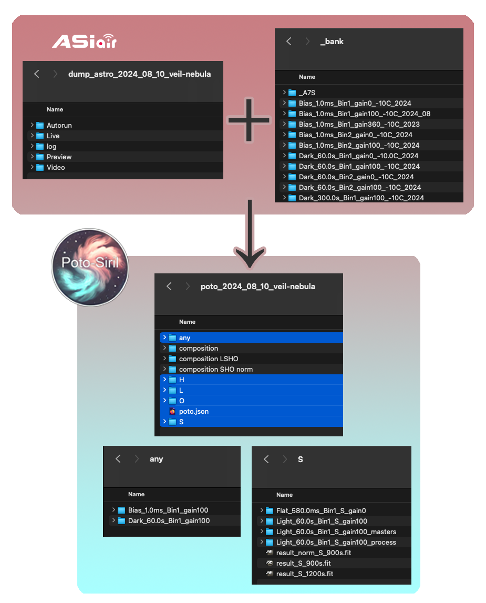
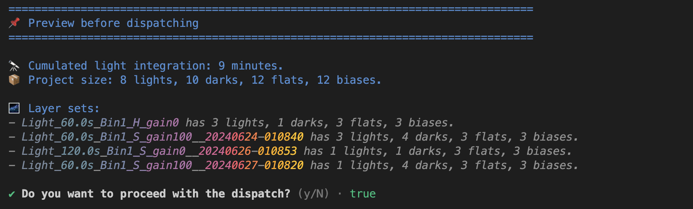
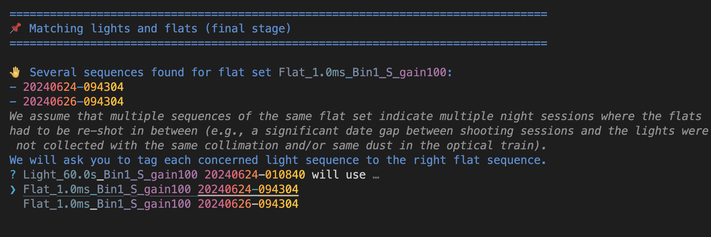

# 

Automatization around Siril (<https://siril.org/>) for deep sky astrophotography.

[](https://codecov.io/gh/TomyCesaille/poto-siril)

## What is it?

**Poto-Siril is a CLI tool to automate the pre-processing of astrophotography images on top of Siril.**

Poto-Siril aims to **overcome the repetitive and tedious** work when pre-processing multiple layers before compositing an (L)RGB image (e.g. narrowband filters with a monochrome camera or a color camera with dual-band filters).

It works with images captured by a ZWO ASIAIR device out of the box or with any `fit` files that follow the same [file naming convention](#file-naming-convention) and [directory structure](#asiair-directory-structure-for-reference) (more support to come, help is welcomed 👋).

### Workflow 🚀

The essence of Poto-Siril is about:

- Organizing the raw data by grouping the multiple light sequences together in small groups (of the same filter, bulb, gain, etc...) tagged with the appropriate flats, darks, and biases.
- Running Siril script(s) on each group of lights to retrieve the calibrated lights, following:

```math
Calibrated\_Light = \frac{Light\_Frame - Dark\_Frame}{Flat\_Frame}
```

- Stacking the calibrated lights to get a master light for each layer/filter.



### In detail

- **Easy import of lights and flats from night session(s) and search for associated darks and biases in a bank folder**
  Import one or several night sessions (e.g. lights and flats from `Autorun` or `Plan` mode with ASIAIR) and automatically pick the darks and biases from the bank folder (matching bulb, gain, binning, ...).
  A summary resumes the light sequence(s) and the calibration files associated.
  
- **Complex Light - Flat matching**
  Poto-Siril helps to associate the right flats with the right lights when the project consists of multiple night sessions where the flats changed over time, e.g., a significant date gap between shooting sessions having a new  collimation tuning and/or new dust in the optical train.
  
- **Multi-layers project structure**
  The imported files ☝️ are organized by filters and light sets (bulb, gain & binning, if there are multiple combinations). Each light set will map to a light sequence in Siril to be pre-processed separately.
  👉 You can easily work on an LRGB or LRGBHaOIIISII project.
- **Batch Siril script execution to pre-process the data**
  (Generates and) Runs a Siril script (`.ssl` file) to calibrate the lights for each light set, based on a customizable ssl file template.
- **A/B testing** (PLANNED)
  Run the (generated ☝️) Siril script with different parameters (e.g. rejection algorithm, sigma low/high thresholds) and compare the results.
  Or run several different pre-processing scripts and compare the results.

### What it is not doing

Poto-Siril does not eliminate bad light images, and everything related to the final processing such as channel compositing, color calibration, background extraction, etc...

## Usage

### First installation

Install [node](https://node.org) latest version and run:

```bash
npm i

# For Unix based systems:
chmod +x ./poto.sh

# Test the CLI:
./poto.sh -v
# Should print `poto-siril 0.3.0`.
```

Make sure to have `siril` registered in your PATH.

```bash
siril -v
# Should print `siril 1.2.3`.
```

### CLI commands

```bash
$POTO_PROJECT=jorislacance/deepsky/poto_2024_08_10_veil-nebula

# Prepare a Poto project by importing imaging data session(s) and "static" calibration files (darks, biases).
./poto.sh prepare \
  # e.g. ASIAIR dump folder with Autorun directory filled with lights and corresponding flats.
  -i jorislacance/deepsky/sessions/asiair_2024_08_10_veil-nebula \
  # e.g. Bank folder where poto-siril will cherry-pick darks and biases as needed.
  -i jorislacance/deepsky/_bank \
  # 🎉 poto project directory destination.
  $POTO_PROJECT

# Batch pre-process all the lights, set by set (filter, bulb, gain, binning...) based on a Siril script template.
export POTO_SCRIPT_TEMPLATE=src/pipeline/Mono_Preprocessing/Mono_Preprocessing.ssf
./poto.sh preprocess \
  -t $POTO_SCRIPT_TEMPLATE \
  $POTO_PROJECT

# BONUS: Drop thumbnails and empty directories generated by ASIAIR.
./poto.sh clear jorislacance/deepsky/sessions/asiair_2024_08_10_veil-nebula
```

### Pre-processing pipeline

Usually, the pre-processing is a multi-step journey. The most usual case is to pre-process lights, eliminate bad ones in Siril directly, and go back to Poto-Siril to batch-run the stacking.

You can chain multiple scripts to achieve the desired result.
See [src/pipeline/Mono_Preprocessing/README.md](src/pipeline/Mono_Preprocessing/README.md) for a full example of a pre-processing pipeline.

#### Create your own

You can easily create your own by following the [Mono_Preprocessing pipeline](src/pipeline/Mono_Preprocessing) example.

Some remarks about **Poto-Siril script templates**:

- `.ssf` extension like regular Siril scripts.
- Poto-Siril dynamically overwrites the `{{poto-dir}}`, `{{lights}}`, `{{flats}}`, `{{darks}}`, `{{biases}}`, `{{process}}` & `{{masters}}` variables to the current light set to pre-process.

### File naming convention

Poto-Siril expects the files to follow the ASIAIR file naming convention `{Light|Flat|Dark|Bias}_{TARGET}_{EXPOSURE_TIME}{s|ms}_Bin{BINNING}_{FILTER}_gain{GAIN}_{DATE}-{TIME}_{TEMPERATURE}C_{SEQUENCE_NUMBER}.fit`.

For example:

- `Light_10.0s_Bin1_S_gain360_20240320-203324_-10.0C_0001.fit`
- `Light_FOV_60.0s_Bin1_S_gain100_20240624-010840_-10.1C_0001.fit`
- `Flat_1.0ms_Bin1_S_gain100_20240320-233122_-10.5C_0001.fit`
- `Dark_300.0s_Bin1_S_gain100_20240320-233122_-10.5C_0001.fit`
- `Bias_1.0ms_Bin1_S_gain100_20240320-233122_-10.5C_0001.fit`

### Poto-Siril project architecture

```text
# Poto project root directory
├── S    👈 Directory for each filter.
│   ├── Light_M42_10.0s_Bin1_S_gain360    👈 Sub directory for each light set (BIN-GAIN-BULB combination).
|   │   ├── Light_M42_10.0s_Bin1_S_gain360_20240320-203324_-10.0C_0001.fit
│   │   └── ...
│   ├── Light_M42_10.0s_Bin1_S_gain100
|   │   ├── Light_M42_10.0s_Bin1_S_gain100_20240321-223159_-10.0C_0001.fit
│   │   └── ...
│   └── Flat_1.0ms_Bin1_S_gain100
|       ├── Flat_1.0ms_Bin1_S_gain100_20240320-233122_-10.5C_0001.fit
│       └── ...
├── H
├── O
├── ...
└── any    👈 Biases & darks fall here. lights & flats too if no filter.
```

> 💡 `S`, `H`, `O` are the filter names defined in ASIAIR (cf Filter Wheel settings).

### The bank folder (for reference)

It's common to store the **darks** and **biases** in a 'bank folder' since they are quite static. Poto-siril doesn't expect any precise directory structure for a directory to act like a bank folder as long as the [file naming convention](#file-naming-convention) is respected.

Example of structure:

```text
# Bank directory
├── Bias_1.0ms_Bin1_gain100_-9.9C_2024
│   ├── Bias_1.0ms_Bin1_L_gain100_20240308-154935_-10.0C_0001.fit
│   ├── Bias_1.0ms_Bin1_L_gain100_20240308-154936_-9.9C_0002.fit
│   └── ...
├── Darks_300.0s_Bin1_gain100_-10C_2024
│   ├── Dark_300.0s_Bin1_L_gain100_20240308-172757_-10.0C_0001.fit
│   ├── Dark_300.0s_Bin1_L_gain100_20240308-160224_-10.0C_0002.fit
│   └── ...
└── ...
```

### ASIAIR directory structure (for reference)

```text
# Root dump directory of an ASIAIR session
├── Autorun
│   ├── Light
|   |   └── M42
|   |       ├── Light_M42_10.0s_Bin1_S_gain360_20240320-203324_-10.0C_0001.fit
│   |       ├── ...
|   |       ├── Light_M42_10.0s_Bin1_S_gain100_20240321-223159_-10.0C_0001.fit
|   |       └── ...
│   └── Flat
|       ├── Flat_1.0ms_Bin1_S_gain100_20240320-233122_-10.5C_0001.fit
│       └── ...
├── Plan
│   # Same structure as Autorun.
├── Live
│   # Ignored in poto-siril
├── Preview
│   # Ignored in poto-siril
├── Video
│   # Ignored in poto-siril
└── log
    # Ignored in poto-siril
```

## Development

```bash
# Run the tests
npm test

# Run the linter
npm run lint

# Run type checking
npm run check-types

# Generate dataset 1 for development
npm run dev-spawn-ds1

# Run dev-spawn-ds1 & the prepare command with the development dataset 1
npm run dev-prepare-ds1

# Run the preprocess command with the development dataset 1
npm run dev-preprocess-ds1
```

## Side Notes

[Sirilic and Sirilot](https://siril.org/2018/11/sirilic-and-sirilot-two-very-useful-utilities-for-siril/) are two alternatives to automate Siril. This project is another take that emphasizes the laziness of manipulating files in the file system, the love of Siril Scripting, and A/B testing.
