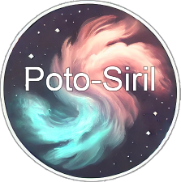

# 

Automatization around Siril (<https://siril.org/>) and ASIAIR for deep sky astrophotography.

## What is it?

**Poto-Siril is a CLI tool to automate the pre-processing of astrophotography images on top of Siril.**

Poto-Siril's primary goal is to **overcome the repetitive** work when pre-processing multiple layers before compositing a (L)RGB image (e.g. narrowband filters with monochrome camera or color camera with dual-band filters). It works with images captured by a ZWO ASIAIR device out of the box or with any `fit` files that follows the same [naming convention and directory structure](#poto-siril-project-architecture).

### Workflow 🚀


### In detail

- **Easy import lights and flats from ASIAIR and search for associated darks and biases in bank folder**
  Import one or several night sessions (lights and flats from `autorun` or `plan` mode with ASIAIR) and automatically pick the darks and bias from the bank folder (matching bulb, gain, binning, ...).
  A summary resumes the light sequence(s) and the calibration files associated.
  
- **Multi-layers project structure**
  The imported files ☝️ are organized by filters and light sets (bulb, gain & binning, if there's multiple combinations). Each light set will map to a light sequence in Siril that you preprocess separately.
  👉 You can easily work on a LRGB or LRGBHaOIIISII project.
- **Batch Siril script execution to pre-process the data**
  Generates and run a Siril script (`.ssl` file) for each light set to preprocess the images based on a ssl file template that can be customized.
- **A/B testing** (PLANNED)
  Run the (generated ☝️) Siril script with different parameters (e.g. rejection algo, sigma low/high thresholds) and compare the results.
  Or run several different pre-processing scripts and compare the results.

### What it is not doing

Poto-Siril does not eliminate bad light images, and everything related to the final processing such as channel compositing, color calibration, background extraction, etc...

## Usage

### First installation

Install [node](https://node.org) latest version and run:

```bash
npm i

# For Unix based systems:
chmod +x ./poto.sh
```

Make sure to have `siril` registered in your PATH.

```bash
siril -v
# Should print `siril 1.2.3`.
```

### Poto-Siril project architecture

The ASIAIR directory structure is as follows:

```text
# Root dump directory of an ASIAIR session
├── Autorun
│   ├── Light
|   |   └── M42
|   |       ├── Light_M42_10.0s_Bin1_S_gain360_20240320-203324_-10.0C_0001.fit
│   |       ├── ...
|   |       ├── Light_M42_10.0s_Bin1_S_gain100_20240321-223159_-10.0C_0001.fit
|   |       └── ...
│   └── Flat
|       ├── Flat_1.0ms_Bin1_S_gain100_20240320-233122_-10.5C_0001.fit
│       └── ...
├── Plan
│   # Can be picked up by poto-siril with `-m plan` option.
│   # Same structure as Autorun.
├── Live
│   # Ignored in poto-siril
├── Preview
│   # Ignored in poto-siril
├── Video
│   # Ignored in poto-siril
└── log
    # Ignored in poto-siril
```

Poto project, once imported from the ASIAIR dump via the `dispatch` command, will be broke down into the following directory structure:

```text
# Poto project root directory
├── S    👈 Directory for each filter.
│   ├── Light_M42_10.0s_Bin1_S_gain360    👈 Sub directory for each light set (BIN-GAIN-BULB combination).
|   │   ├── Light_M42_10.0s_Bin1_S_gain360_20240320-203324_-10.0C_0001.fit
│   │   └── ...
│   ├── Light_M42_10.0s_Bin1_S_gain100
|   │   ├── Light_M42_10.0s_Bin1_S_gain100_20240321-223159_-10.0C_0001.fit
│   │   └── ...
│   └── Flat_1.0ms_Bin1_S_gain100
|       ├── Flat_1.0ms_Bin1_S_gain100_20240320-233122_-10.5C_0001.fit
│       └── ...
├── H
├── O
├── ...
└── any    👈 Biases & darks falls here. lights & flats too if no filter.
```

> 💡 `S`, `H`, `O` are the filters names defined in ASIAIR (cf Filter Wheel settings).

### The bank folder

The bank folder is where you store your **darks** and **biases** files. The bank folder does not expect a specific structure as long as files are following the ASIAIR file naming convention.

A good organization could be as follows:

```text
# Bank directory
├── Bias_1.0ms_Bin1_gain100_-9.9C_2024
│   ├── Bias_1.0ms_Bin1_L_gain100_20240308-154935_-10.0C_0001.fit
│   ├── Bias_1.0ms_Bin1_L_gain100_20240308-154936_-9.9C_0002.fit
│   └── ...
├── Darks_300.0s_Bin1_gain100_-10C_2024
│   ├── Dark_300.0s_Bin1_L_gain100_20240308-172757_-10.0C_0001.fit
│   ├── Dark_300.0s_Bin1_L_gain100_20240308-160224_-10.0C_0002.fit
│   └── ...
└── ...
```

### CLI commands

```bash
# The location of your raw ASIAIR root folder (also named dump folder).
export POTO_ASIAIR_DUMP=/Users/jorislacance/deepsky/dump_2024_08_10_veil-nebula

# Drop thumbnails and empty directories from the ASIAIR dump folder.
./poto.sh clean -a $POTO_ASIAIR_DUMP

# Import lights to project, grouped per filter, and then light sets (bulb, gain & binning)
# with the related calibration files (flats, darks and biases).
export POTO_BANK=/Users/jorislacance/deepsky/_bank
export POTO_PROJECT=/Users/jorislacance/deepsky/poto_2024_08_10_veil-nebula

./poto.sh dispatch -a $POTO_ASIAIR_DUMP -b $POTO_BANK -p $POTO_PROJECT -m autorun

# Process each light set based on a Siril script template.
export POTO_SCRIPT_TEMPLATE=src/process/mono_processing_process/1_preprocessing.ssf

./poto.sh preprocess -p $POTO_PROJECT -s $POTO_SCRIPT_TEMPLATE
```

### Full pre-processing

See [src/process/mono_processing_process/README.md](src/process/mono_processing_process/README.md) for a full example of a pre-processing process.

#### Create your own process

You can easily create your own process by following the example of the [mono_processing_process](src/process/mono_processing_process) process.

Some remarks about **Poto-Siril script templates**:

- `.ssf` extension like regular Siril scripts.
- Poto-Siril overwrite the `{{lights}}`, `{{flats}}`, `{{darks}}`, `{{biases}}`, `{{process}}`, `{{masters}}` variables to the current light set to pre-process.

## Development

```bash
# Run the tests
npm test

# Run the linter
npm run lint

# Run type checking
npm run check-types

# Generate dataset 1 for development
npm run dev-spawn-ds1

# Run the CLI dispatch-dump with the development dataset 1
npm run dev-dispatch-ds1
```

## Side Notes

[Sirilic and Sirilot](https://siril.org/2018/11/sirilic-and-sirilot-two-very-useful-utilities-for-siril/) are two alternatives to automate Siril. This project is another take that emphasize lazyness of manipulating files in the file system, the love of Siril Scripting and A/B testing.

"assembling the composition, making the pre-groups of lights with the right flats (days, filderss...)
